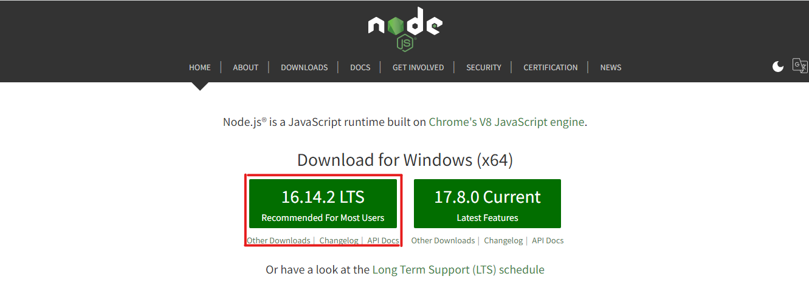
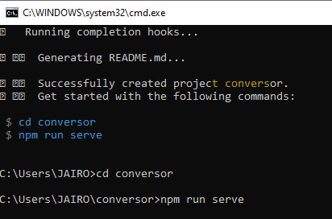
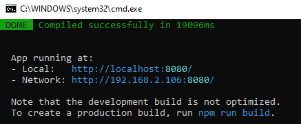

# **Criando um conversor de moedas com Vue JS**

Trabalho feito para disciplina de Desenvolvimento Web sobre o framework Vue JS - Implementação de um conversor de moedas

**Integrantes do grupo:** Jairo Pedro, Luana Teixeira e Matheus Souza.

Para este projeto, primeiramente é necessário a instalação do VS Code e do Node js em sua máquina. Para baixar e instalar o VS Code basta acessar o 
[site](https://code.visualstudio.com/download) e selecionar a opção de acordo o Sistema Operacional de sua máquina

 

E para baixar o Node.JS basta acessar o [site](https://nodejs.org/en/) e fazer o download. 



E seguir para os passos dados na janela de instalação. Por padrão, você não precisa alterar nada: apenas siga clicando em “Next”.

Também será necessário o NPM (ou Yearn). Acesse o [link](https://cli.vuejs.org/) -> get started - > Installation

 

 


Para instalar o novo pacote, use um dos comandos a seguir. Você precisa de privilégios de administrador para executá-los, a menos que o npm tenha sido instalado em seu sistema por meio de um gerenciador de versões do Node.js (por exemplo, n ou nvm).


``` npm install -g @vue/cli ou yarn global add @vue/cli ```


Você pode verificar a versão correta com este comando:

``` vue --version ```


Agora daremos início ao projeto, e para isso usaremos o comando (vue create) e nome do projeto. 

Criando o projeto Conversor: Abra o prompt de comando do seu computador e digite o seguinte comando: 

```vue create conversor ```


Aparecerá esta tela, na qual você irá escolher primeira opção default e pressionar a tecla **"ENTER"**:


Assim será feita a instalação, logo em seguida execute os seguintes comandos para que sua aplicação seja servida: 

Primeiro digite o comando: 

``` cd conversor ```

e pressione a tecla **"ENTER"**, logo após digite o segundo comando:

``` npm run serve ``` 

e pressione a tecla **"ENTER"** novamente.



Agora você pode acessar a tela do padrão do projeto em: http://localhost:8080/.



E aparecerá a seguinte tela padrão:


Depois você pode encerrar o projeto digitando **“S”** e abri-lo automaticamente no VS Code, para isso é necessário digitar o comando: 

``` code . ```


Agora iniciaremos a implementação do projeto.

Por padrão, dentre os arquivos e pastas criadas automaticamente na instalação do npm, tem-se o componente **“HelloWord.vue”** que neste caso não será utilizado, por isso você poderá deletá-lo, excluindo também os que estão dentro da pasta **“App.vue”**.


 

Feito isso, iniciaremos criando um novo componente chamado **“Conversor.vue”** em **src/components**, criando também a seguinte estrutura:

 

Para criar o conversor de moeda, é preciso escrever o seguinte código:

1º Inserindo códigos que farão parte do **template**

 

2º- Inserindo códigos que farão parte do **script**

 


3º- Inserindo códigos que farão parte do **style**

 

Após inserir os códigos do componente **“ConversorM”** é preciso criar os conversores dentro do arquivo **“App.vue”**, ficando assim:

 

E aqui será definido o estilo dos conversores.

 

## Resultados:
Agora você pode acessar o link (http://localhost:8080/) para visualizar e testar o conversor de moedas.

 
 


**Teste: Convertendo de dólar para real e vice-versa.**

Basta digitar o valor que deseja e clicar em **Converter**.
 

**Referência do código:** Programador BR.Criando um conversor de moedas com VUE JS-S02E10.Data de acesso: 2 de abril de 2022. Disponível em: <https://youtu.be/tIEa3MRBpI0>.
