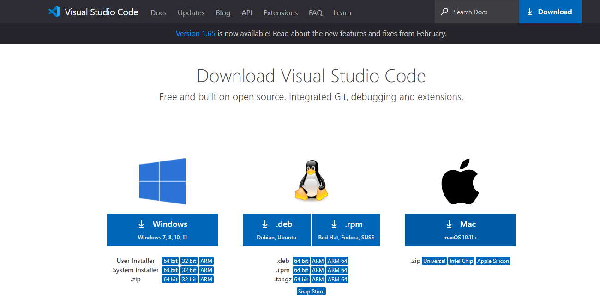

# Trabalho_web_VueJs
Trabalho de web sobre o framework Vue JS - implementação de um conversor de moedas

**Criando um conversor de modas com Vue JS**

Para este projeto, primeiramente é necessário a instalação do VS Code e do Node js em sua máquina. Para baixar e instalar o VS Code basta acessar o 
[site](https://code.visualstudio.com/download) e selecionar a opção de acordo o SO de sua máquina.

 adionar imagem

