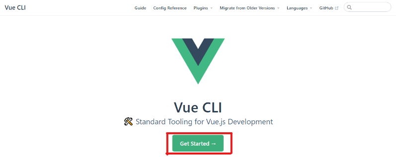
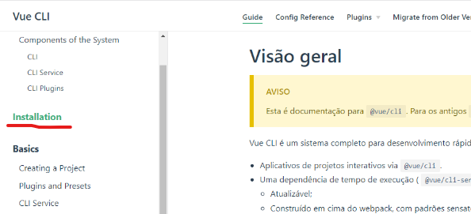
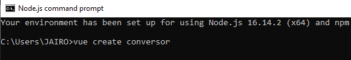
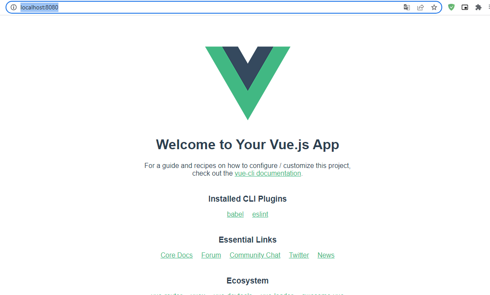

# Trabalho_web_VueJs
Trabalho de web sobre o framework Vue JS - implementação de um conversor de moedas

**Criando um conversor de modas com Vue JS**

Para este projeto, primeiramente é necessário a instalação do VS Code e do Node js em sua máquina. Para baixar e instalar o VS Code basta acessar o 
[site](https://code.visualstudio.com/download) e selecionar a opção de acordo o SO de sua máquina.

 

E para baixar o Node.JS basta acessar o site: https://nodejs.org/en/  e fazer o download. 


 

 

``` npm install -g @vue/cli ou yarn global add @vue/cli ```








 

 

 

 

 

 

 

 

 

 
